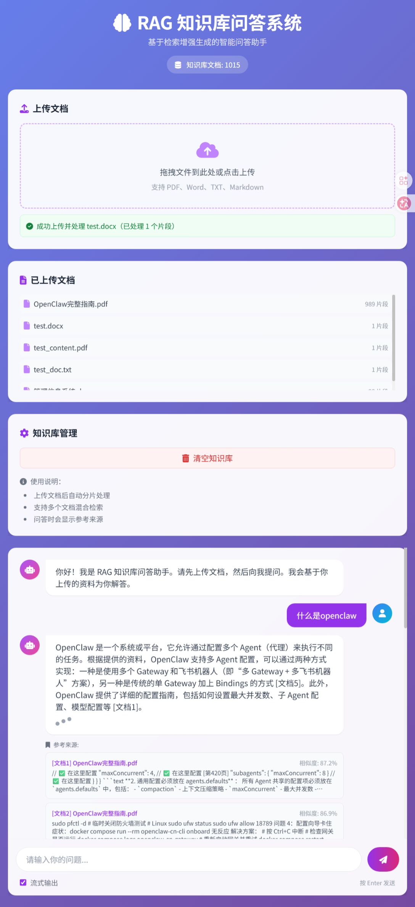

# RAG-based Knowledge Base Question Answering System

基于 RAG (Retrieval-Augmented Generation) 的知识库问答系统，支持多种文档格式的上传、智能检索和问答。

## 功能特性

- 📄 **多格式文档支持**：PDF、Word、TXT、Markdown
- 🔍 **智能检索**：基于向量相似度的语义检索
- 🤖 **大模型问答**：支持 Kimi (Moonshot) / OpenAI API
- 🗄️ **向量数据库**：使用 ChromaDB 存储文档向量
- 🌐 **Web 界面**：简洁美观的交互界面
- ⚡ **流式输出**：实时显示回答内容

## 技术栈

- **后端**：Python + FastAPI
- **向量数据库**：ChromaDB
- **Embedding**：本地 sentence-transformers 模型（支持中文）
- **LLM**：Kimi (Moonshot) / OpenAI API
- **前端**：HTML + JavaScript + Tailwind CSS
- **文档处理**：PyPDF2、python-docx

## 快速开始

### 1. 安装依赖

```bash
pip install -r requirements.txt
```

### 2. 配置环境变量

创建 `.env` 文件（参考 `.env.example`）：

**使用 Kimi (推荐)：**
```env
OPENAI_API_KEY=sk-your-kimi-api-key
OPENAI_BASE_URL=https://api.moonshot.cn/v1
LLM_MODEL=moonshot-v1-8k
```

**使用 OpenAI：**
```env
OPENAI_API_KEY=sk-your-openai-api-key
OPENAI_BASE_URL=https://api.openai.com/v1
LLM_MODEL=gpt-3.5-turbo
```

> 注意：Kimi 不提供 embedding API，系统会自动使用本地 embedding 模型处理文档。

### 3. 启动服务

```bash
python main.py
```

访问 http://localhost:8000 即可使用。

## 项目结构

```
.
├── main.py              # FastAPI 主程序
├── rag_engine.py        # RAG 核心引擎
├── document_processor.py # 文档处理模块
├── requirements.txt     # 依赖列表
├── .env.example         # 环境变量示例
├── static/              # 静态文件
│   └── index.html       # 前端页面
└── chroma_db/           # 向量数据库目录
```

## API 文档

启动服务后访问：http://localhost:8000/docs

## 截图



> **如何添加自己的截图：**
> 1. 启动服务后访问 http://localhost:8000
> 2. 按 `Win + Shift + S` 截图
> 3. 将图片保存为 `screenshot.png` 放在项目根目录
> 4. 或者上传到 GitHub Issues 获取图片链接替换上面的 URL

## 界面预览

### 主要功能区域
- **左侧**：文档上传区 + 已上传文档列表 + 删除按钮
- **右侧**：问答对话框 + 流式输出显示

## License

MIT License
